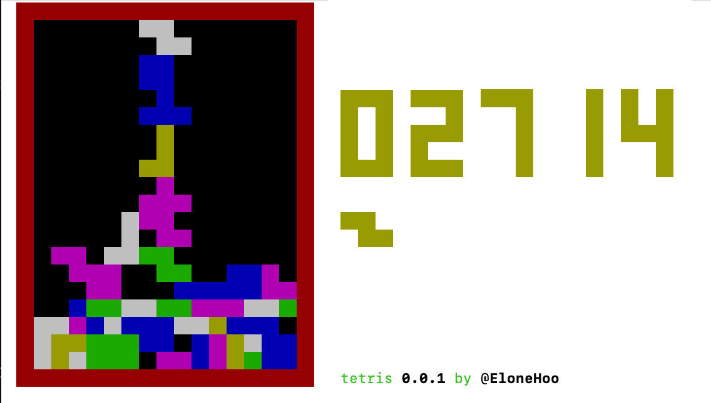

<div align="center">

</div>

<h1 align="center">Tetris Cli</h1>

<div align="center">
<a href="https://www.npmjs.com/package/@elonehoo/tetris-cli"></a>
</div>

## How to play

```bash
npx @elonehoo/tetris-cli
```


